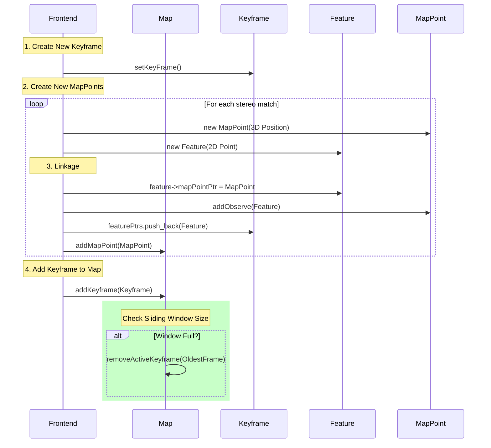
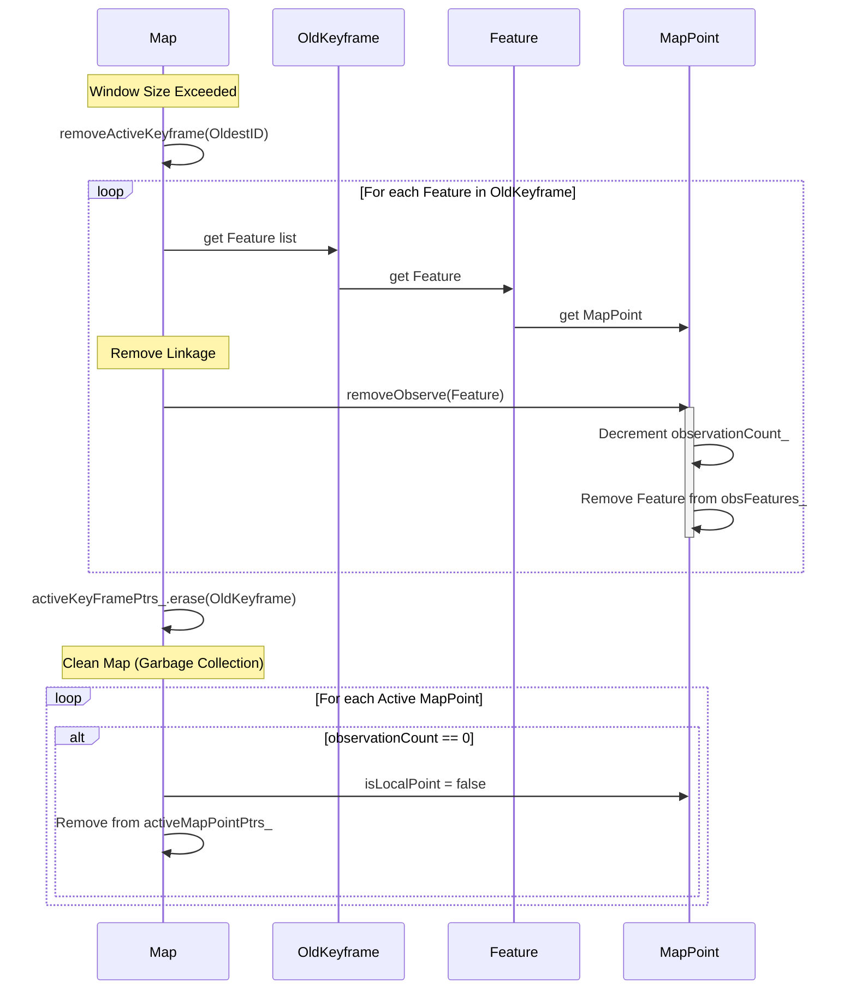
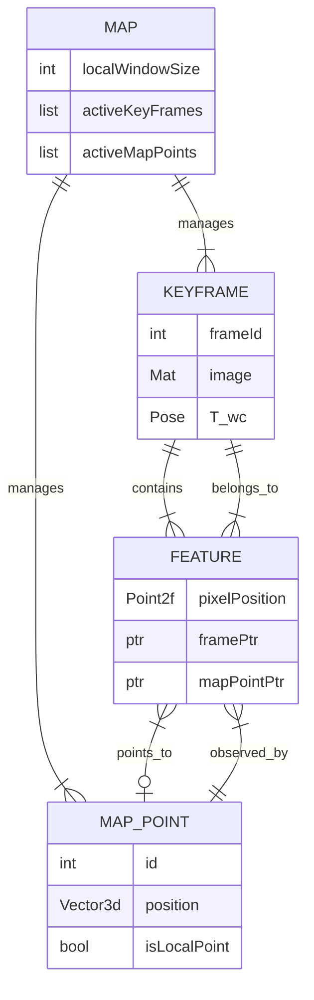

# Map Management Logic

This document explains the lifecycle of **Keyframes** and **MapPoints** in the Stereo Visual Odometry system, specifically how they are added to and removed from the active map (sliding window).

## 1. Adding a Keyframe & MapPoints

When the Frontend decides to create a new Keyframe (e.g., enough movement occurred):

1.  **Create Keyframe**: The current frame is promoted to a Keyframe.
2.  **Create MapPoints**: New 3D points are triangulated from stereo matches.
3.  **Linkage (via Feature)**:
    - A `Feature` object is created to represent the 2D keypoint.
    - The `Feature` stores a pointer to the `MapPoint`.
    - The `MapPoint` adds the `Feature` as an observation.
    - The `Keyframe` stores the `Feature`.
4.  **Add to Map**:
    - `Map::addKeyframe()` adds the frame to the active window.
    - `Map::addMapPoint()` adds the new points to the active map.

## 2. Removing a Keyframe (Marginalization)

When the sliding window is full (e.g., > 10 frames), the oldest keyframe is removed to keep optimization fast.

1.  **Remove Active Keyframe**: `Map::removeActiveKeyframe(OldestID)` is called.
2.  **Remove Observations**:
    - Iterate through all `Feature`s in the Oldest Keyframe.
    - For each `Feature`, find the corresponding `MapPoint`.
    - Call `MapPoint::removeObserve(Feature)`.
3.  **Clean Map**:
    - Check all active MapPoints.
    - If a MapPoint has **0 observations** left (meaning no other active keyframe sees it), it is removed from the active map (`isLocalPoint = false`).

## 3. Data Structure Relationships (ER Diagram)

If we view the system as a relational database, the `Feature` class acts as the **Join Table** (or Association Entity) connecting `Keyframe`s and `MapPoint`s.

- **Map**: The container holding the global state.
- **Keyframe**: Represents a camera pose at a specific time.
- **MapPoint**: Represents a 3D landmark in the world.
- **Feature**: Represents a 2D observation of a `MapPoint` in a specific `Keyframe`.

